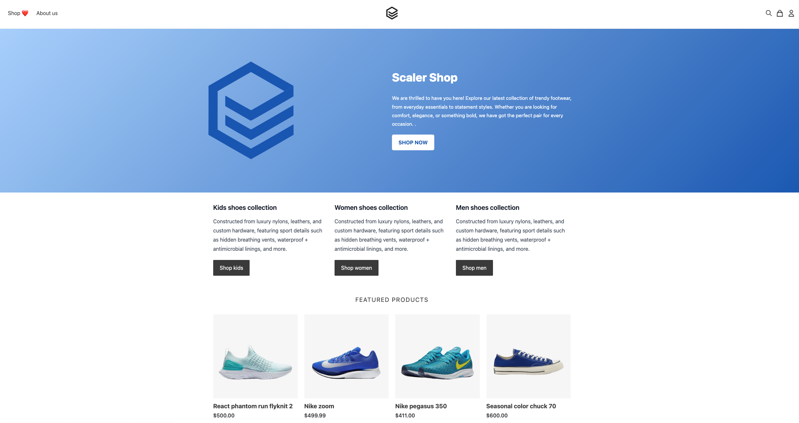
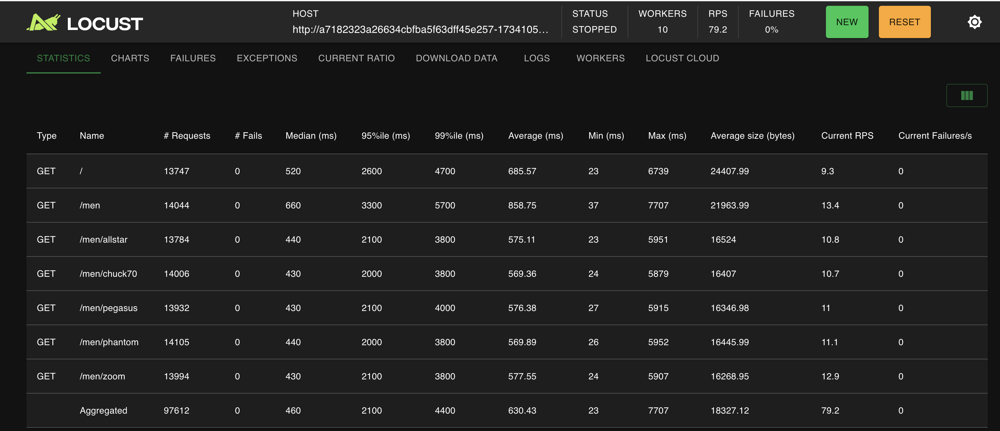

## dbo-ecom-demo

Welcome to dbo ecommerce demo app!!

## Setup Guide

### Prereqs

1. Cluster on AWS with an RDS instance. Use the smallest instance available for the RDS instance. 
2. Eks cluster with DBO cache installed
3. AWS load balancer controller installed -- [directions](https://docs.aws.amazon.com/eks/latest/userguide/lbc-helm.html)


### Step 1 - Update Secret with the RDS hostname and password

```
kubectl apply -f demo/1-secret.yaml
```


### Step 2 - Create the DB

```
kubectl apply -f demo/2-create-db.yaml
```


### Step 3 - Deploy demo app
```
kubectl apply -f demo/3-demo-ecom-app.yaml
```


### Step 4 - Setup admin user for demo-ecom-app & boostrap mock data

```
kubectl exec -it demo-ecom-app-pod-name -- /bin/sh
npm run user:create -- --email "admin@admin.com" --password "admin123" --name "admin" 
```

### Step 5 - Insert product info

```
kubectl apply -f demo/4-insert-data.yaml
```
### Step 6 - Deploy load test


You are set to go!!!

## E-COM Demo App


This project is based on https://github.com/evershopcommerce/evershop

## Locust load app

Load Generation config
DB CPU - 0.5 ACU TO 1.5 ACU
No of users at concurrency - 200
Ramp up users - 10




## Troubleshooting FAQ'S


1. Add new endpoints to locust to simulate load <br>
 add task with new endpoints to hit in confimap of locaust-load.yaml. Restart locust master & workers.

```
        @task
        def get_products(self):
            self.client.get("/men")

        @task
        def get_products_allstar(self):
            self.client.get("/men/allstar")
```